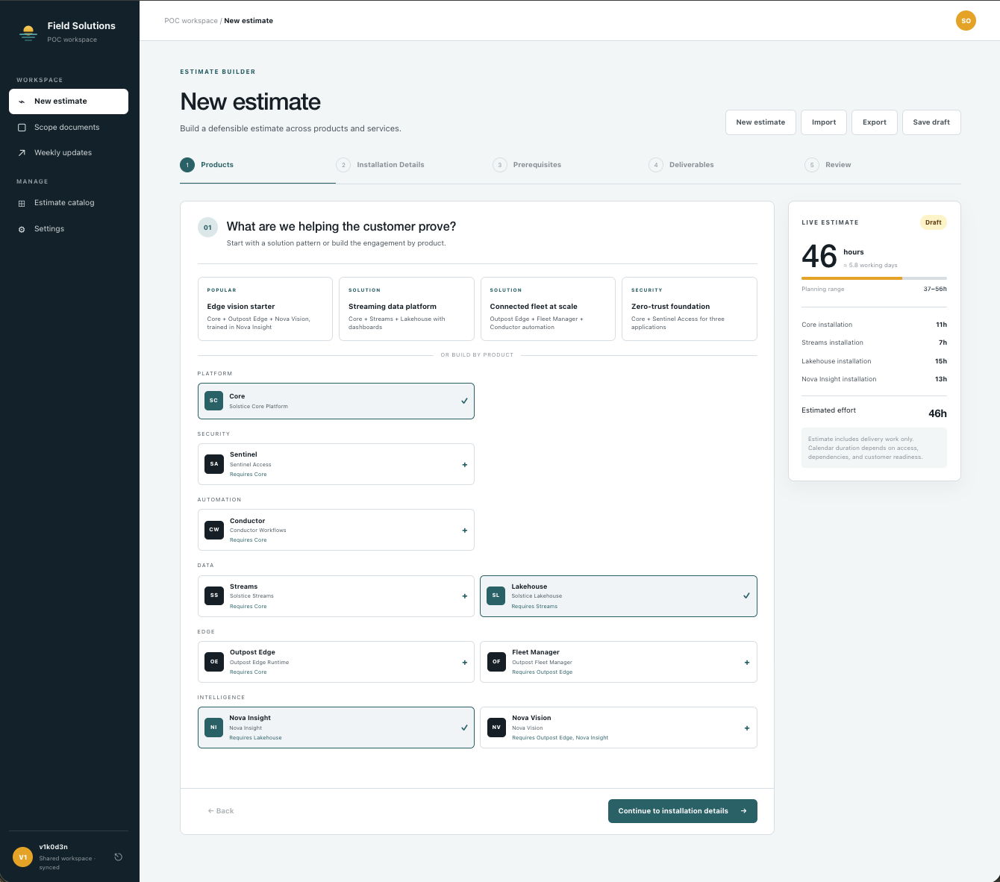

# Scopewright

Scopewright is a web workspace for scoping, estimating, and documenting
proof-of-concept engagements. A solutions architect picks the products a
customer wants to prove, answers installation questions that each carry hours, records what
the customer must provide, selects deliverables, and gets a live estimate and
a customer-facing scope document ready to sign. The estimate is in hours:
the solutions architect's investment in the customer's success, whether or
not the POC is paid.



It ships vendor-neutral: an empty catalog and a fictitious brand. Every
product, installation question, prerequisite, deliverable, solution card,
color, font, and logo is editable in the app, and all of it can be exported
and imported as files. `packs/solstice` is a complete fictitious vendor to
start from.

- **[User guide](docs/guide.md)**: the estimate workflow step by step, the
  scope document, catalog management, branding, and import/export.
- **[Authoring a catalog](docs/authoring.md)**: the model, the file format,
  and conventions, written so that an AI assistant can build a catalog from
  your product documentation. Want help building an Estimate Catalog? Point
  your AI agent at that page.
- **[Deploying on OpenShift](docs/openshift.md)**: the reference deployment
  with login through the cluster's identity providers.
- **[Deploying with systemd](docs/systemd.md)**: a rootless Podman `.kube`
  Quadlet, with localhost access and your existing proxy handling remote login.

## How the pieces fit

```
Estimate catalog (Manage)             New estimate (Workspace)          Scope document
─────────────────────────             ────────────────────────          ──────────────
Products + portfolios           ──►   1. Products                  ─┐
  base work package hours               (solution cards, foundations) │
  required foundations                                                │
Solutions                       ──►                                   │
Installation decisions          ──►   2. Installation details        ─┼──►  every decision with its hours,
  question → choices → hours            (one drop-down per question)  │     prerequisites with status,
Prerequisites per product       ──►   3. Prerequisites               ─┤     numbered deliverables,
  label, example, required              (value + status per item)     │     effort summary, success
Deliverable groups              ──►   4. Deliverables                ─┤     criteria, assumptions,
  tied to a product                     (only groups for the          │     sign-off lines, brand
  tasks → phase → hours                  products in the engagement)  │
                                      5. Review                      ─┘
Settings (Manage): identity, logo, colors, fonts → the app and every document
```

- **Products** live in the catalog. A product that requires a foundation
  (an analytics product that needs the core platform) pulls it into the
  estimate automatically, and any product can be marked "already exists" so
  it adds no installation hours.
- **Installation decisions** are the per-product decision tree. Each choice
  carries hours; the chosen answer is added to the estimate and printed in
  the scope.
- **Prerequisites** are what the customer must provide before work starts,
  pre-populated per product and tracked with a value and status.
- **Deliverables** are grouped tasks with a delivery phase and hours, offered
  only when their product is in the engagement.
- **The scope document** is generated from all of the above plus the goal,
  success criteria, and assumptions, and prints to PDF.

The hour math lives in `app/lib/estimate.ts` and is covered by `tests/`,
which use `packs/solstice/catalog.json` as their reference catalog.

## Persistence

- **Catalog and brand are shared.** The server exposes
  `/api/workspace/catalog` and `/api/workspace/branding` (GET/PUT), backed by
  JSON files under `DATA_DIR` (see `app/lib/server-store.ts`). Both deployment
  targets mount persistent storage there, so every visitor sees the same
  catalog and brand and edits survive restarts. The sidebar shows the sync
  state; if the API is unreachable the app falls back to this browser only.
- **Each person's working estimate is private** to their browser. Use
  Export / Import on the New estimate page to hand a finished estimate to a
  colleague or to reload one later when the customer amends the scope. The
  file is versioned JSON; hours are recomputed against the current catalog on
  import.
- **Themes and catalogs are files.** Settings exports and imports a theme
  pack (`.zip` with `theme.json`, logo, and favicon; see
  `app/lib/theme-pack.ts`) and the catalog (`.json`).
- The built-in brand is a fictitious team ("Company Solution Architects /
  Northeast Sales", the Navy color theme, system fonts) and the catalog is
  empty. Settings offers five non-branded color themes; any edited palette
  can be saved under a name, and saved themes travel in the theme pack.

## Authentication

Scopewright does not authenticate users itself. An authenticating reverse
proxy in front of it (OpenShift oauth-proxy, oauth2-proxy, Cloudflare Access,
Traefik ForwardAuth, ...) handles login and asserts the identity in request
headers; `app/lib/identity.ts` reads them. Everything is configuration:

| Variable | Meaning | Default |
|----------|---------|---------|
| `AUTH_MODE` | `open`: everyone may read and write. `proxy`: identity headers determine who may write; the proxy controls access to the app. | `open` |
| `AUTH_USER_HEADER` / `AUTH_EMAIL_HEADER` | Headers carrying the username and email | `x-forwarded-user` / `x-forwarded-email` |
| `AUTH_GROUPS_HEADER` | Header carrying comma-separated groups | `x-forwarded-groups` |
| `AUTH_EDITORS` | Comma-separated usernames or emails allowed to change the shared catalog and theme | empty: every admitted user |
| `AUTH_EDITOR_GROUP` | A group whose members may write | unset |
| `AUTH_LOGOUT_URL` | Sign-out link shown to signed-in users | unset |
| `AUTH_DEV_USER` | In open mode, a name to show as signed in locally | unset |

Viewers see the catalog and settings read-only; the API answers writes from
them with 403. Read requests do not require identity headers, so the proxy
must authenticate every remote request and replace client-supplied identity
headers. OpenShift binds the app to localhost inside the pod; the systemd
target publishes only on host localhost. Local users who can reach that
port can forge identity headers, so the systemd host must be trusted.

## Development

[](https://github.com/v1k0d3n/scopewright/actions/workflows/ci.yml)

CI runs on every push and pull request and weekly: lint, type-check, and
unit tests; a production build with a smoke test of the server in open and
proxy modes; a container build from the `Containerfile`; deployment rendering
and configuration checks; `npm audit`
(runtime dependencies gate at moderate, the whole tree at high); and CodeQL
security and quality analysis (on public repositories, where GitHub provides
code scanning). Dependabot proposes npm, GitHub Actions, and
base-image updates weekly.

```bash
npm install
npm run dev      # http://localhost:3000, open mode, no login
npm test         # estimate engine, theme pack, and identity tests
npm run check    # lint + type-check + tests + production build
npm run build && npm start   # the production server, as the container runs it
```

## Deploying

The app is a plain Node server. `Containerfile` builds it on a UBI 9 Node.js
22 base and serves it with `vinext start` on port 3000; run it anywhere
containers run, and put an authenticating proxy in front of it.

Two targets share Kubernetes manifests in `deploy/base`:

- **[OpenShift](docs/openshift.md)** adds cluster OAuth login, routing, RBAC,
  and an on-cluster image build.
- **[systemd](docs/systemd.md)** runs the app with a rootless Podman `.kube`
  Quadlet on `127.0.0.1:3000`, behind an existing authenticating proxy.

Each target has an example Kustomize overlay; copy it to the git-ignored
`overlays/local` directory for your values.

## Estimate, catalog, and theme files

All three are versioned JSON (the theme inside a zip) with a `format` field:
`scopewright-estimate`, `scopewright-catalog`, and `scopewright-theme`.

## Layout

- `docs/` — user guide, deployment guides, and screenshots
- `packs/` — importable example content (theme, catalog, sample estimate)
- `deploy/base/` — shared app Deployment, configuration, and persistent storage
- `deploy/openshift/` — OpenShift additions, an example overlay, and the build script
- `deploy/systemd/` — Podman adjustments, an example overlay, and the `.kube` Quadlet

- `app/lib/` — data model (`types.ts`), built-in themes and the empty
  default catalog (`defaults.ts`), estimate engine (`estimate.ts`), theme variables
  (`theme.ts`), localStorage hook (`storage.ts`)
- `app/components/` — one component per screen or workflow step
- `app/page.tsx` — navigation shell and state wiring
- `app/globals.css` — the single stylesheet; every color and font is a CSS
  variable that Settings overrides at runtime
