# Scopewright user guide

Scopewright turns a conversation with a customer into a priced, signed-off
proof-of-concept scope. This guide walks through the whole workflow using the
fictitious **Solstice Systems** example that ships in `packs/solstice`.

Contents

1. [The workspace](#the-workspace)
2. [Building an estimate](#building-an-estimate)
3. [The scope document](#the-scope-document)
4. [Weekly updates](#weekly-updates)
5. [Saving, exporting, and importing estimates](#saving-exporting-and-importing-estimates)
6. [Managing the estimate catalog](#managing-the-estimate-catalog)
7. [Branding and themes](#branding-and-themes)
8. [Loading the Solstice example](#loading-the-solstice-example)
9. [Editors and viewers](#editors-and-viewers)

## The workspace

The sidebar has two sections. **Workspace** is day-to-day use: New estimate,
Scope documents, and Weekly updates. **Manage** is setup: the Estimate catalog
(what your team sells and how it is priced) and Settings (how the workspace
looks). The bottom of the sidebar shows who is signed in and the sync state
of the shared catalog and brand, for example "Shared workspace · synced" or
"View only".

Two kinds of data live in Scopewright:

- **Shared**: the catalog and the brand. Everyone who opens the workspace
  sees the same ones; only editors can change them.
- **Private**: the estimate you are working on. It stays in your browser
  until you export it as a file.

## Building an estimate

Open **New estimate**. The five steps run left to right, and the **Live
estimate** card on the right updates with every choice: total hours, the
equivalent working days, a planning range of ±20 percent, and a line per
product and deliverable group.

### 1. Products

Start with a **solution card** at the top, which selects a pre-canned set of
products in one click, or build by product from the portfolios below. A
product that **requires** a foundation (Lakehouse requires Streams, which
requires Core) pulls the foundation into the estimate automatically; the
Products step shows the requirement under each product. The solution cards
come from the catalog and can be empty.

### 2. Installation details

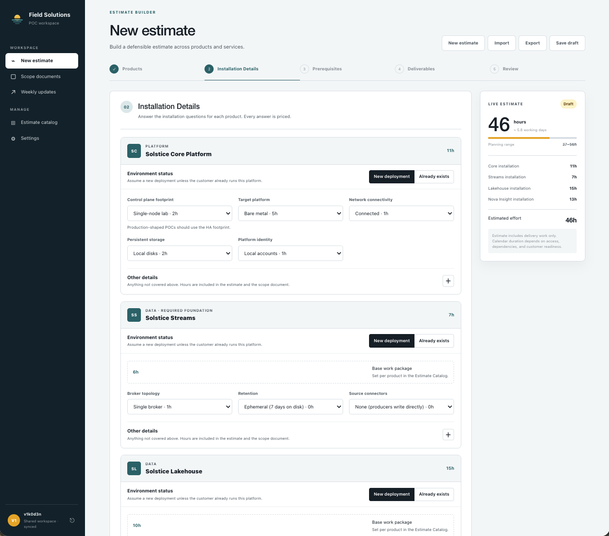

Every product in the engagement gets a frame with its **installation
decisions** as drop-downs, each answer priced in hours. Products the customer
already runs can be switched to **Already exists**, which removes their
installation hours but keeps their prerequisites and deliverables available.
A product's **base work package** (if it has one) is shown for transparency.
**Other details** lets you add free-text work with hours for anything the
catalog does not cover; it appears in the estimate and the scope document.

### 3. Prerequisites

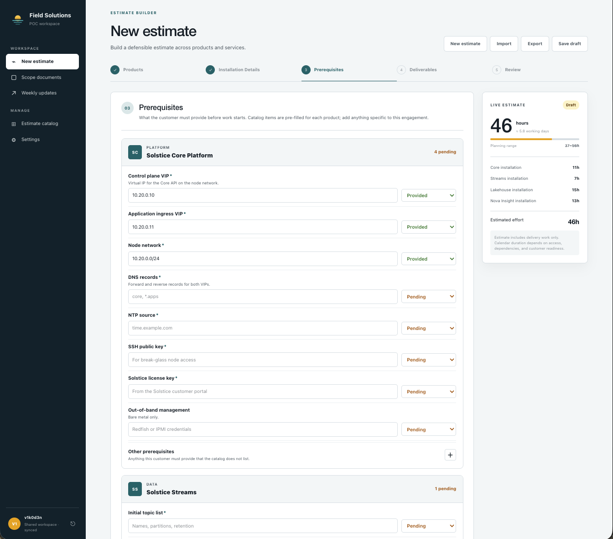

What the customer must provide before work starts, pre-populated from the
catalog for each product: VIPs, networks, DNS, credentials, licenses, sample
data, and so on. Type the value and the status flips to **Provided**; set
**Pending** or **Not applicable** by hand. Required items are starred and the
frame header counts what is still pending. **Other prerequisites** adds items
specific to this engagement.

### 4. Deliverables

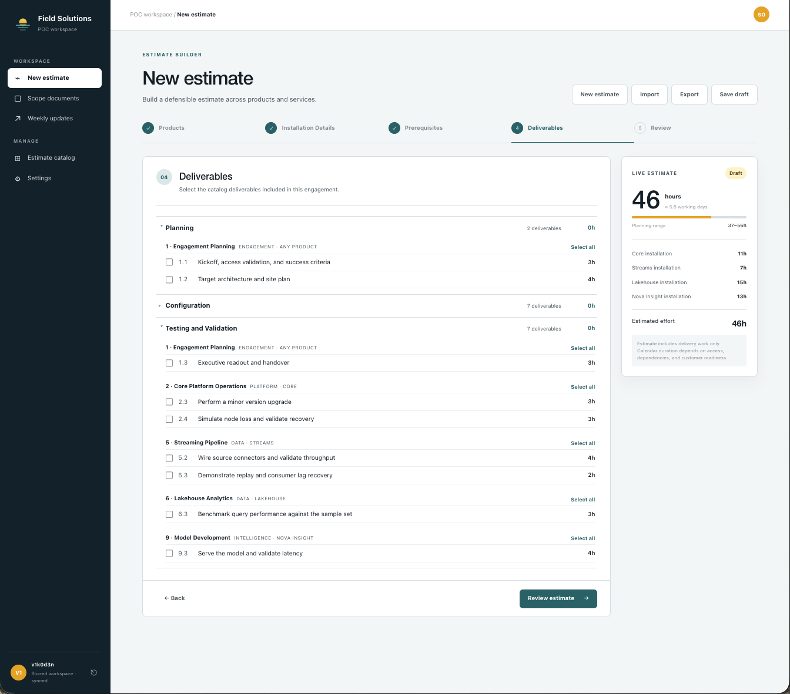

Deliverables are grouped by delivery phase (Planning, Prerequisites,
Deployment, Configuration, Testing and Validation) and within a phase by
catalog group. Only groups tied to a product in the engagement, or to no
product, are offered. Tick individual tasks or **Select all** for a group;
the phase header totals the hours selected.

### 5. Review

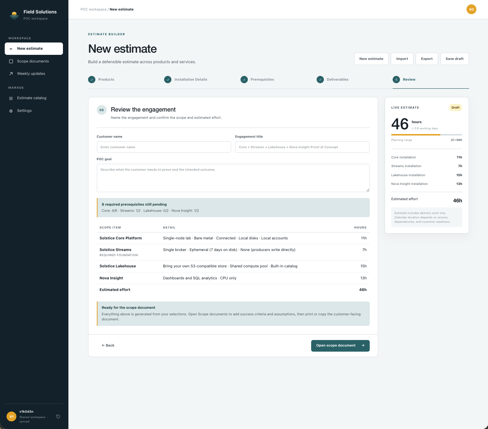

Name the customer and the engagement, describe the POC goal, and confirm the
scope table: one row per product with its chosen decisions and hours, one per
deliverable group, and the total. A banner shows how many required
prerequisites are still pending. **Open scope document** saves the draft and
moves on.

## The scope document

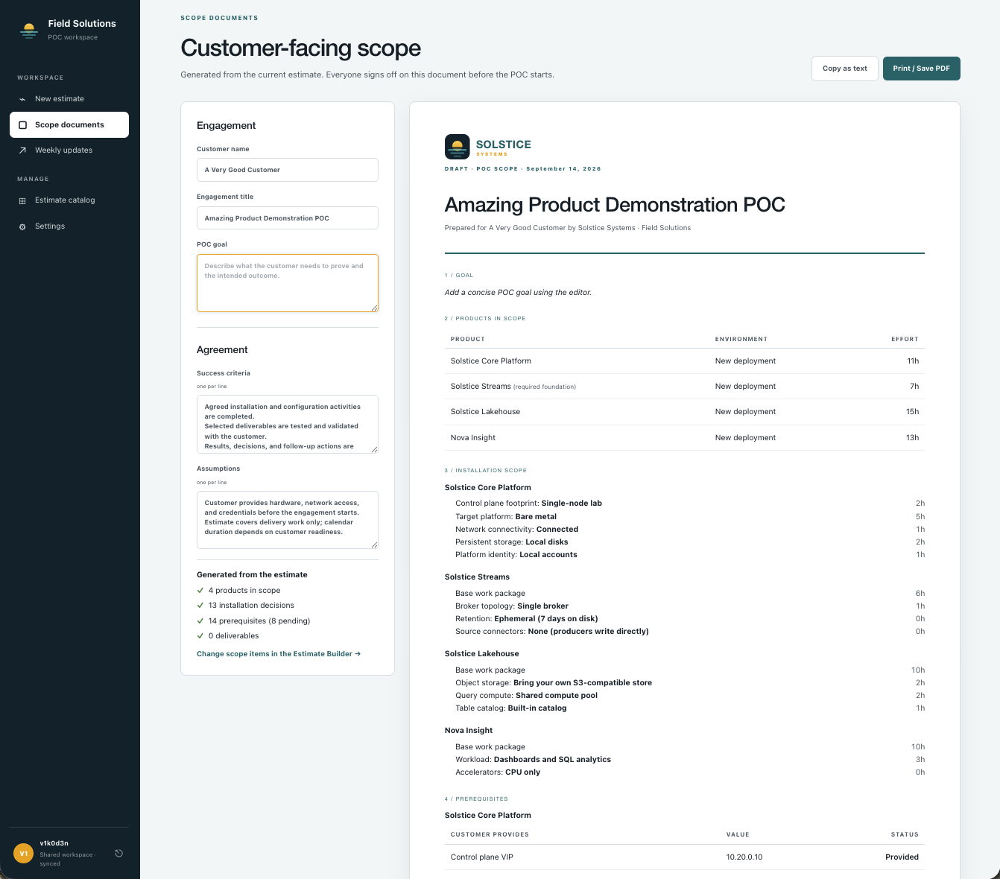

The scope document is generated from the estimate and is the paperwork the
customer, the account team, and the delivery team sign off on. The editor on
the left holds the narrative: customer, title, goal, **success criteria**,
and **assumptions** (one per line). The document on the right has eight
sections: goal, products in scope, installation scope (every priced
decision), prerequisites with values and status, delivery plan with numbered
deliverables, effort summary with the planning range, success criteria, and
assumptions, followed by sign-off lines and the footer from Settings.

**Print / Save PDF** uses a print stylesheet that drops the app chrome and
keeps the logo. **Copy as text** puts a plain-text version on the clipboard
for email or a ticket.

## Weekly updates

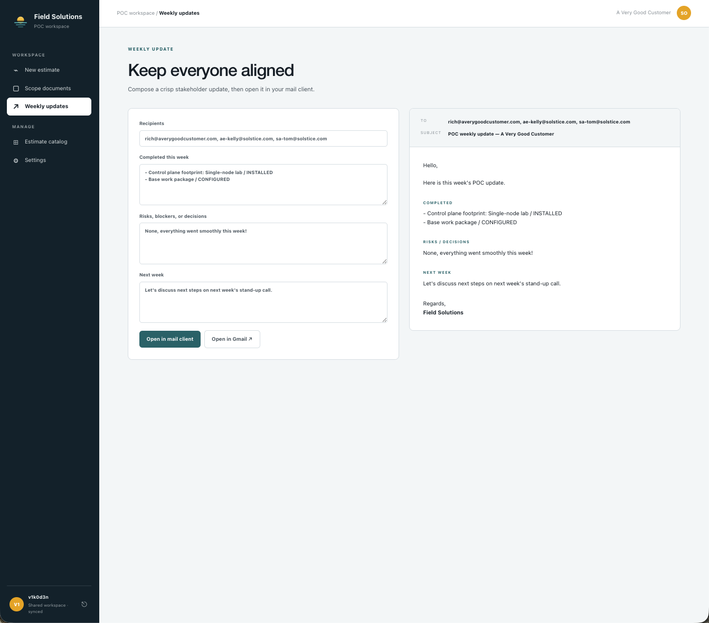

A small composer for the weekly stakeholder note: recipients, what was
completed, risks or decisions, and next week. The preview on the right shows
the email as it will be sent, signed with the workspace name. **Open in mail
client** or **Open in Gmail** hands the draft to your mail app; Scopewright
never sends mail itself.

## Saving, exporting, and importing estimates

The New estimate page has four buttons:

- **New estimate** clears the draft after confirming.
- **Save draft** stores the current estimate in your browser (it is also
  saved automatically as you work).
- **Export** writes the estimate as a versioned JSON file named after the
  customer and date. Use it to hand an estimate to a colleague, keep a copy
  with the deal, or preserve the agreed scope before the customer asks for
  changes.
- **Import** loads such a file after showing what it contains. Hours are
  recomputed against the current catalog, so if prices changed since the
  export, the numbers reflect today's catalog. Products that no longer exist
  in the catalog are dropped with a warning.

Because estimates are private to a browser, exporting is also how you move
one between machines.

## Managing the estimate catalog

The catalog is the shared source of everything an estimate can contain. It
has five tabs, and each tab drives one part of the estimate workflow.

### Products

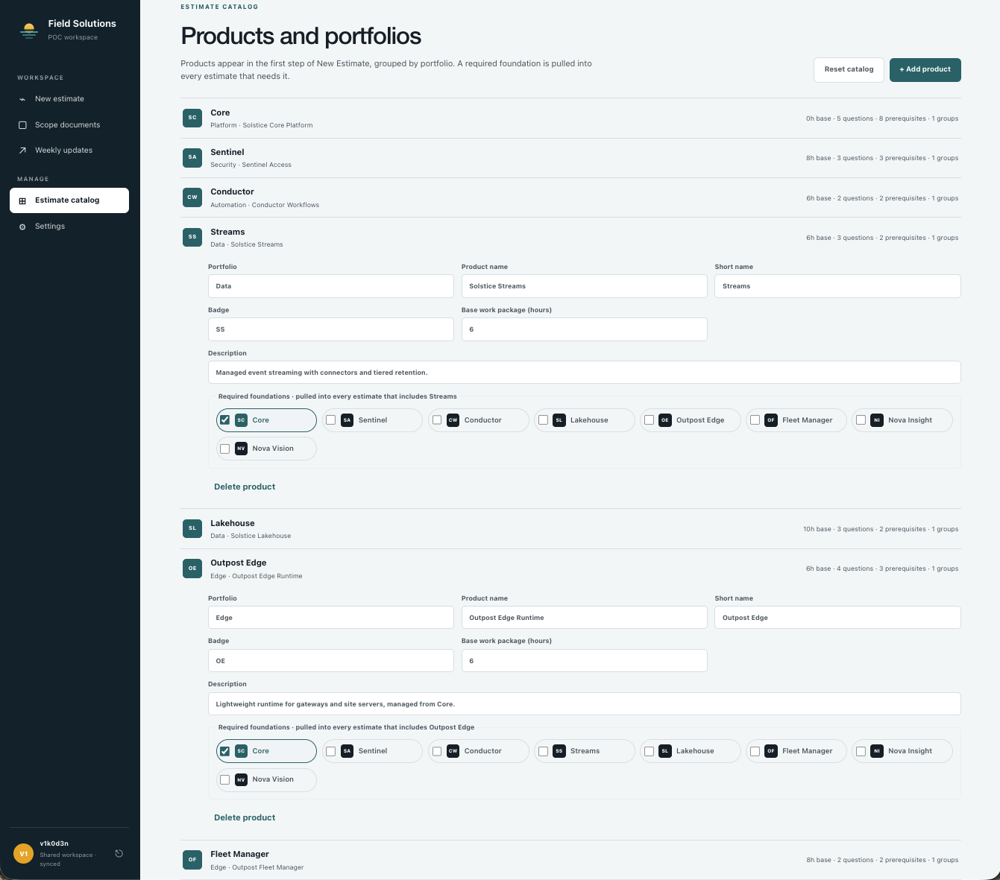

Each product has a portfolio (the heading it appears under), a full name and
short name, a two- or three-letter badge, an optional **base work package**
in hours, a description, and **required foundations**: other products that
are pulled into any estimate that includes this one. A product may require
several. Deleting a product also removes its questions, prerequisites,
deliverable groups, and its mention in solutions.

### Solutions

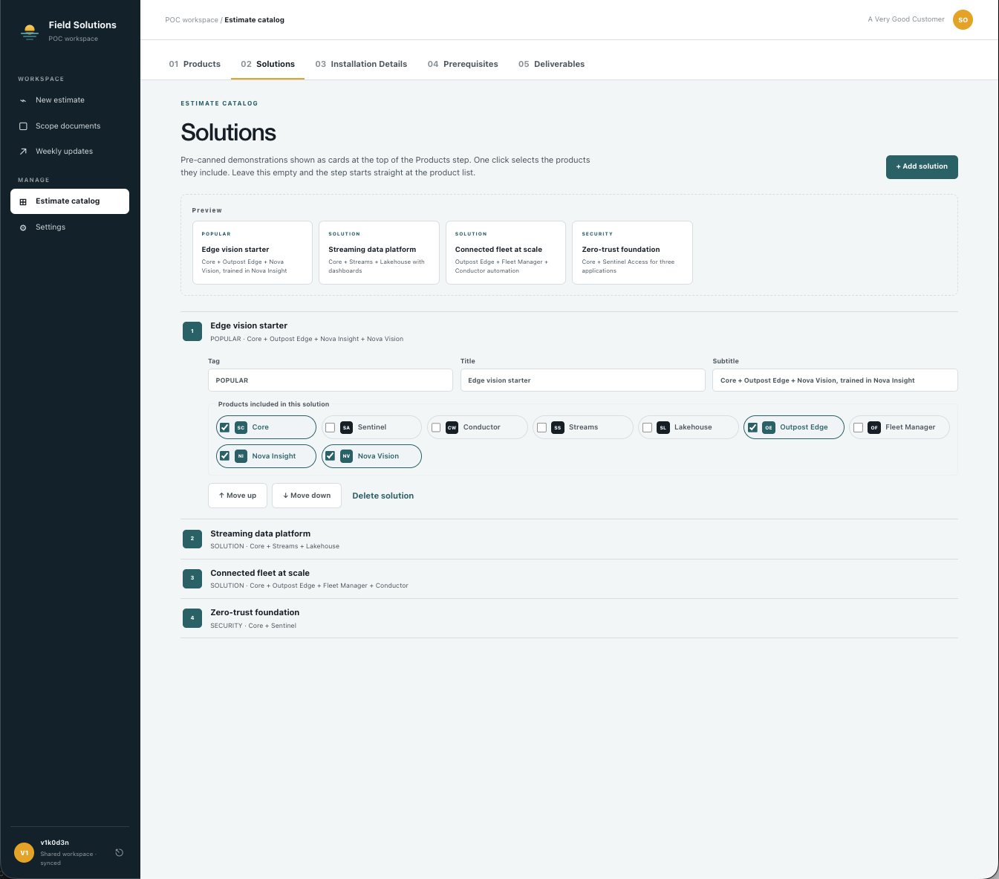

Solutions are the cards at the top of the Products step: a tag ("POPULAR",
"SOLUTION", or anything you like), a title, a subtitle, and the products
they select. The preview shows exactly what the Products step will render.
Reorder with the arrows; leave the list empty and the Products step starts
straight at the product list.

### Installation details

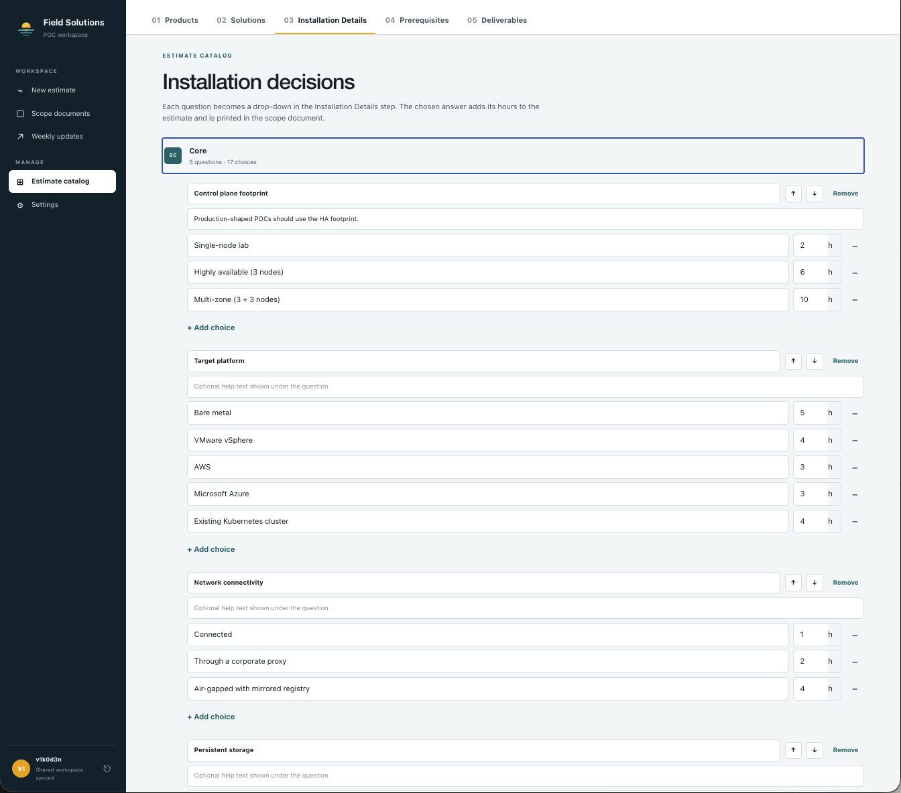

Each product's decision tree. A **question** has optional help text and a
list of **choices**, each with hours. Questions become drop-downs in the
Installation details step; the chosen answer adds its hours and is printed in
the scope document. Reorder questions with the arrows.

### Prerequisites

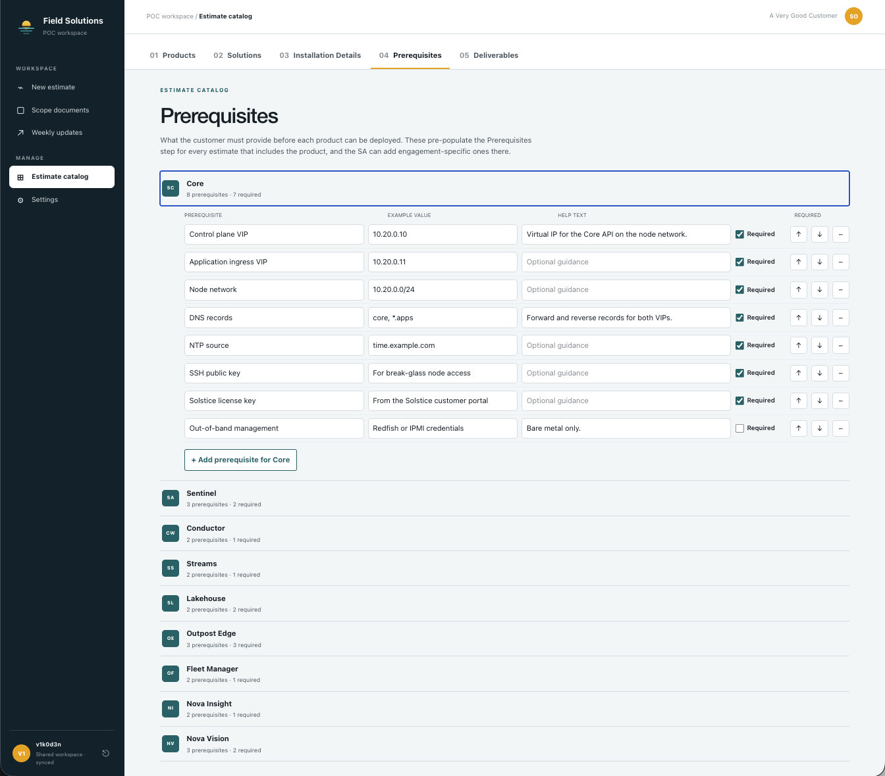

Each product's list of what the customer must provide: a label, an example
value shown as the placeholder, optional help text, and whether it is
required. These pre-populate the Prerequisites step; the SA can still add
engagement-specific ones there.

### Deliverables

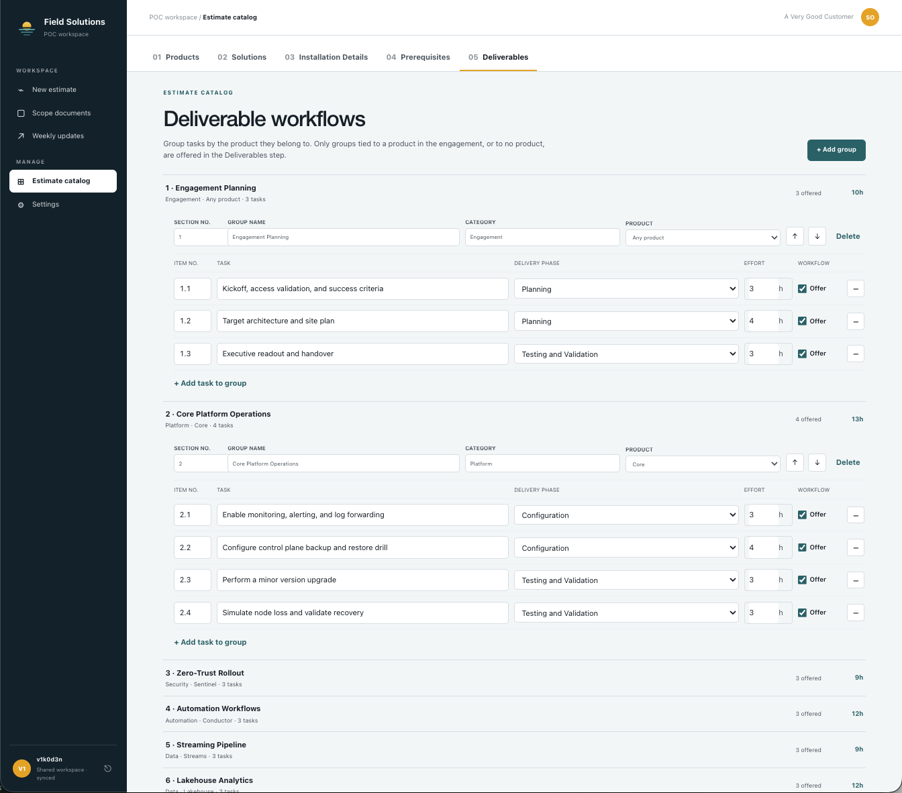

Deliverable **groups** have a section number, a name, a category, and the
product they belong to ("Any product" for engagement-wide work such as
kickoff and readout). Each **task** has an item number, a delivery phase,
hours, and an **Offer** toggle that controls whether it is shown in the
Deliverables step. Numbering carries through to the scope document.

**Reset catalog** on the Products tab returns to an empty catalog. Catalog
export and import live in Settings (see below).

## Branding and themes

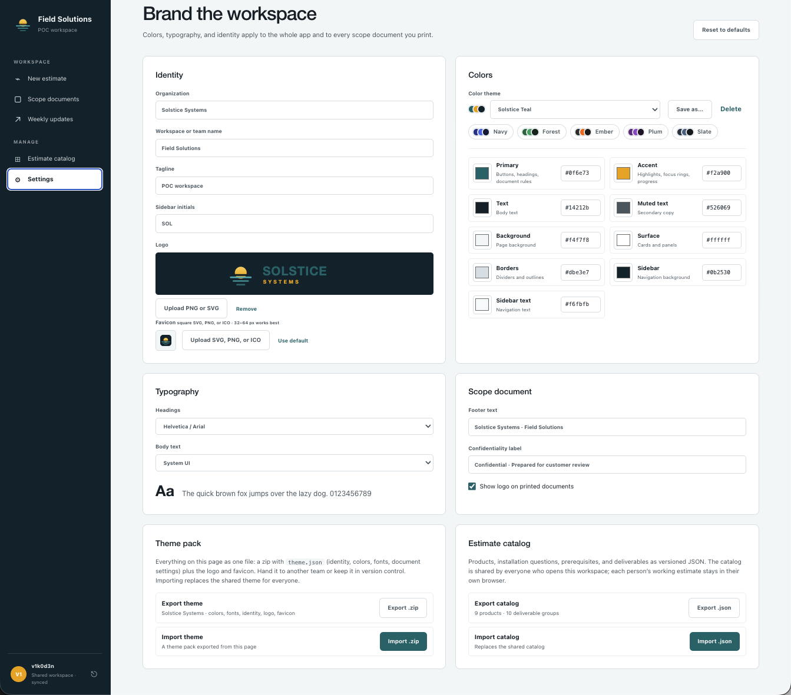

Settings applies to the whole app and to every scope document, for everyone.

- **Identity**: organization, workspace or team name, tagline, sidebar
  initials, a logo (PNG or SVG, shown in the document header), and a favicon
  (also used as the sidebar mark).
- **Colors**: five built-in, non-branded themes (Navy, Forest, Ember, Plum,
  Slate) as chips, plus nine individual colors. Edit any color and the
  drop-down reads "Custom (unsaved)"; **Save theme…** names it, and saved
  themes appear in the same drop-down and travel inside the theme pack.
- **Typography**: heading and body fonts.
- **Scope document**: footer text, confidentiality label, and whether to
  print the logo.
- **Theme pack**: export everything on this page as one `.zip` (a
  `theme.json` plus the logo and favicon files), or import one. This is how a
  design team hands over a brand, and how a theme is kept in version control.
- **Estimate catalog**: export the shared catalog as `.json`, or import one to
  replace it.

Theme packs can also be built from a directory with
`npm run pack:theme -- packs/<name>`.

## Loading the Solstice example

`packs/solstice` is a complete fictitious vendor: nine products with a real
dependency graph, priced decisions, prerequisites, deliverables, four
solutions, a teal-and-amber theme, and a sample estimate for a fictitious
customer.

1. `npm run pack:theme -- packs/solstice` produces `packs/solstice.zip`.
   In Settings, **Import .zip** under Theme pack.
2. In Settings, **Import .json** under Estimate catalog and choose
   `packs/solstice/catalog.json`.
3. On New estimate, **Import** and choose
   `packs/solstice/sample-estimate.json`, then open Scope documents.

`packs/solstice/sample-scope.pdf` is what the result looks like printed.

## Editors and viewers

When Scopewright runs behind an authenticating proxy (see
[openshift.md](openshift.md)), everyone the proxy admits can build estimates
and print scope documents. Only **editors** can change the shared catalog and
brand; everyone else sees those pages read-only with a "View only" notice.
Who is an editor is deployment configuration (`AUTH_EDITORS`), not something
set inside the app.
